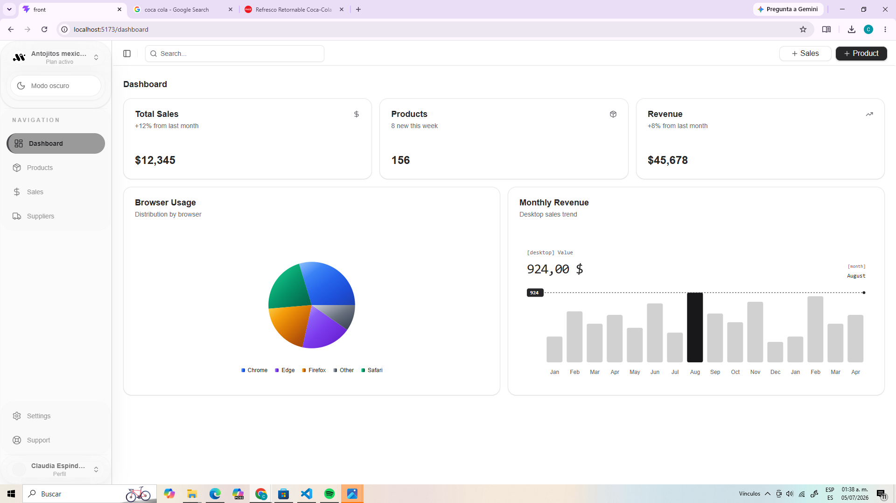
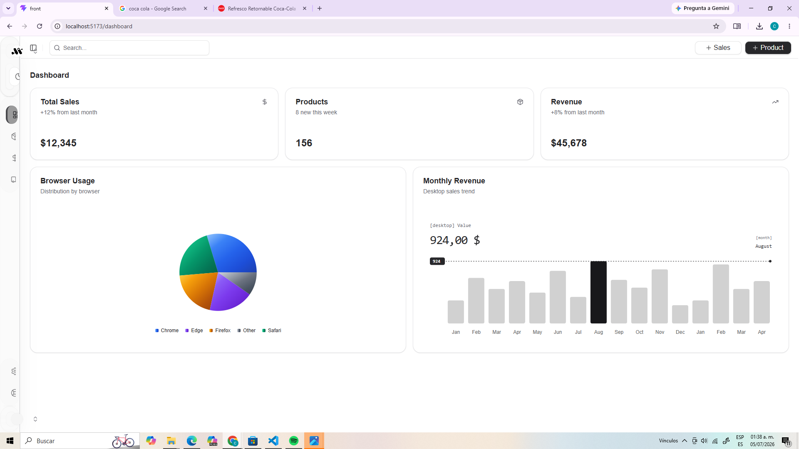
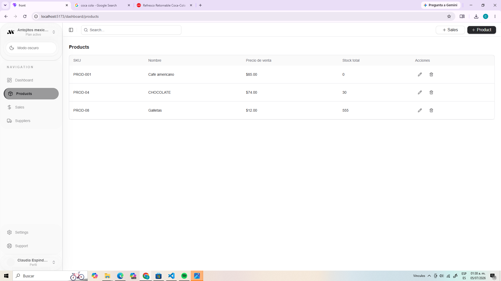
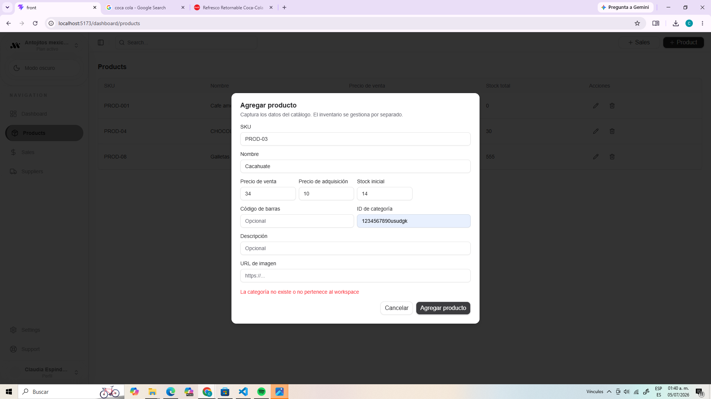

# HEL-36 - Reporte de QA

## Pruebas Funcionales, Validación, Usabilidad y Regresión

**Proyecto:** KiosQ

**Historia:** HEL-36

**Rama:** `chore/hel-36-qa-pruebas`

**Responsable:** Claudia Espíndola López

## **Fecha:** 05 de julio de 2026

# 1. Objetivo

Realizar pruebas funcionales, de validación, usabilidad y regresión al sistema KiosQ con el propósito de verificar que las funcionalidades implementadas operen correctamente, identificar errores visibles para el usuario final y documentar los hallazgos encontrados durante el proceso de aseguramiento de la calidad.

---

# 2. Alcance

Durante este proceso de QA se evaluaron los siguientes módulos del sistema:

- Inicio de sesión y autenticación.
- Dashboard.
- Gestión de productos.
- Gestión de ventas.
- Gestión de proveedores.
- Validación de formularios.
- Búsquedas y filtros.
- Edición y eliminación de registros.
- Comportamiento general de la interfaz.
- Regresión de funcionalidades previamente implementadas.

No se realizaron pruebas relacionadas con:

- Rendimiento.
- Seguridad avanzada.
- Carga concurrente.
- Ataques de penetración.

---

# 3. Entorno de pruebas

| Elemento          | Descripción               |
| ----------------- | ------------------------- |
| Proyecto          | KiosQ                     |
| Frontend          | React + Vite + TypeScript |
| Backend           | NestJS                    |
| Base de datos     | PostgreSQL (Supabase)     |
| Caché             | Redis                     |
| Autenticación     | WorkOS AuthKit            |
| Navegador         | Google Chrome             |
| Sistema operativo | Windows 10                |
| Rama utilizada    | `chore/hel-36-qa-pruebas` |

---

# 4. Casos de prueba ejecutados

En esta sección se documentan las pruebas realizadas durante el proceso de validación del sistema.

---

## QA-01 Inicio de sesión

### Objetivo

Verificar que el sistema permita iniciar sesión correctamente utilizando la autenticación configurada mediante WorkOS.

### Pasos realizados

1. Abrir la aplicación.
2. Seleccionar la opción Iniciar sesión.
3. Autenticarse mediante WorkOS.
4. Esperar la redirección al Dashboard.

### Resultado esperado

El usuario debe autenticarse correctamente y acceder al Dashboard sin errores.

### Resultado obtenido

La autenticación se realizó correctamente y el sistema redireccionó al Dashboard mostrando la información correspondiente.

### Estado

Aprobado.

### Evidencia

Captura del Dashboard después del inicio de sesión. 

---

---

## QA-02 Visualización del Dashboard

### Objetivo

Verificar que el Dashboard cargue correctamente y que la interfaz de navegación sea clara y fácil de utilizar para el usuario.

### Pasos realizados

1. Iniciar sesión en el sistema.
2. Acceder al Dashboard.
3. Verificar la carga de las tarjetas de información.
4. Revisar el menú lateral.
5. Evaluar la facilidad para identificar los módulos disponibles.

### Resultado esperado

El Dashboard debe cargar correctamente mostrando toda la información y el menú lateral debe permitir identificar claramente cada una de las opciones del sistema.

### Resultado obtenido

El Dashboard carga correctamente y muestra la información esperada. Sin embargo, el menú lateral aparece colapsado mostrando únicamente los iconos de navegación, lo que dificulta identificar las distintas opciones disponibles y afecta la experiencia de uso para usuarios nuevos.

### Estado

Parcialmente aprobado.

### Observaciones

Se recomienda mantener el menú lateral expandido por defecto o incorporar una opción más visible para expandirlo, permitiendo que el usuario identifique fácilmente cada módulo del sistema.

### Evidencia

Captura del Dashboard con el menú lateral colapsado donde únicamente se visualizan los iconos de navegación. 

## QA-03 Registro de productos

### Objetivo

Validar que sea posible registrar nuevos productos.

### Pasos realizados

1. Ingresar al módulo Products.
2. Seleccionar "Agregar producto".
3. Capturar la información requerida.
4. Guardar el producto.

### Resultado esperado

El producto debe registrarse correctamente y mostrarse dentro de la lista.

### Resultado obtenido

Los productos fueron registrados correctamente cuando la información era válida.

### Estado

Aprobado.

### Evidencia

Capturas del formulario y del listado actualizado. 

---

## QA-04 Validación de categoría

### Objetivo

Verificar el comportamiento cuando se captura una categoría inexistente.

### Pasos realizados

1. Abrir el formulario de nuevo producto.
2. Capturar un ID de categoría inexistente.
3. Guardar.

### Resultado esperado

El sistema debe impedir el registro mostrando un mensaje claro al usuario.

### Resultado obtenido

El sistema mostró el mensaje:

"La categoría no existe o no pertenece al workspace."

No permitió guardar el producto.

### Estado

Aprobado.

### Observaciones

La validación funciona correctamente desde el backend.

### Evidencia

Captura del mensaje de error mostrado. 
